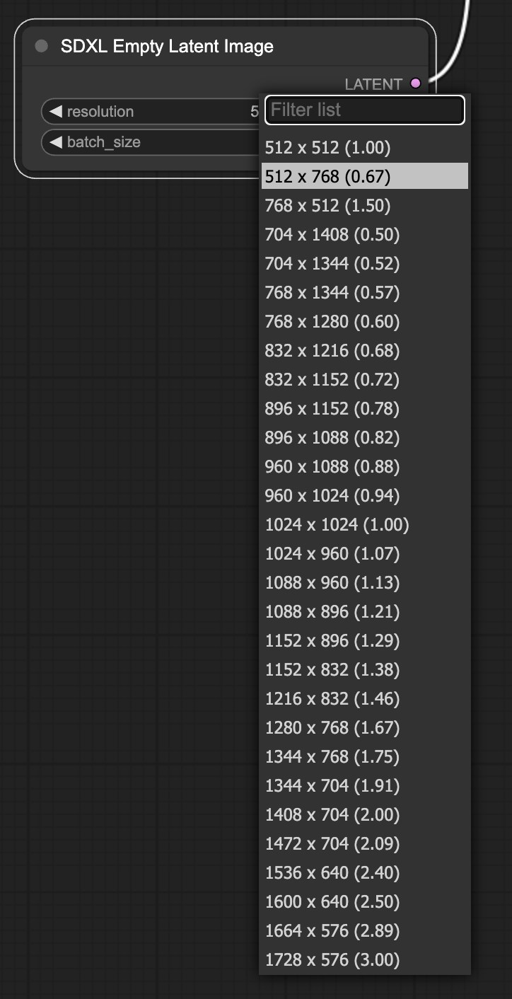

# ComfyUI-SDXL-EmptyLatentImage
予め用意された解像度から選択しLatent Imageを出力する [ComfyUI](https://github.com/comfyanonymous/ComfyUI) 用 拡張ノードです

## 機能
- 以下の書式で保存されたjsonファイルから解像度のリストを取得し、ノードのプルダウンリストから選択可能です。（プルダウンに表示されるアスペクト比は `width / height` で計算しています）
```
[
    {
        "width": 704, "height": 1408
    },
    {
        "width": 704, "height": 1344
    }
]
```
- 予め [sdxl_resolution_set.json](sdxl_resolution_set.json) には、SDXLで学習に使用された最適とされる解像度セットを記述してあります。
- 上記に従った、*.jsonファイルをノード初期化時にロードしますので、別ファイルでカスタム解像度設定の保存が可能です。（サンプルとしてSD1.5用の解像度セット [sd_resolution_set.json](sd_resolution_set.json) を用意しています。）
## インストール
1. ComfyUIを導入してあるフォルダの `cusom_nodes`フォルダに移動
2. `git clone`コマンドを使用して [ComfyUI-SDXL-EmptyLatentImage](https://github.com/shingo1228/ComfyUI-SDXL-EmptyLatentImage) リポジトリをクローン<br>
`git clone https://github.com/shingo1228/ComfyUI-SDXL-EmptyLatentImage`
