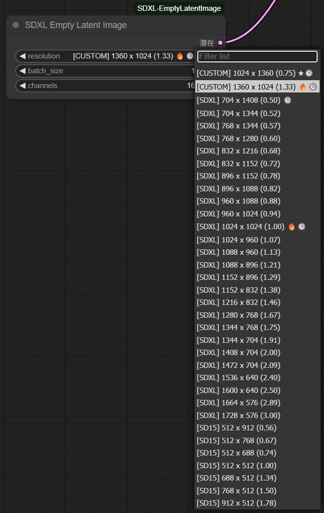

# ComfyUI-SDXL-EmptyLatentImage

[](README.md)
[](README.jp.md)

An extension node for [ComfyUI](https://github.com/comfyanonymous/ComfyUI) that provides resolution selection with usage statistics and configuration management for generating empty latent images.<br>


## Features

### Core Functionality
- **Smart Resolution Selection**: Choose from pre-defined resolutions loaded from JSON files with dropdown selection
- **Category-based Organization**: Automatic categorization (SDXL, SD15, Custom) with prefix display `[Category] Width x Height (aspect_ratio)`
- **Aspect Ratio Display**: Decimal aspect ratios calculated as `width / height` with configurable precision

### Usage Analytics & Visual Feedback
- **Usage Statistics Tracking**: Automatic recording of resolution usage frequency and history
- **Visual Status Indicators**: Dynamic marks displayed at the end of resolution labels:
  - ★ **Favorite** resolutions (manually marked)
  - 🔥 **Frequently used** resolutions (configurable threshold)
  - 🕒 **Recently used** resolutions (configurable limit)
- **Persistent Statistics**: Usage data saved to `usage_stats.json` with timestamps

### Advanced Configuration
- **External Configuration**: Comprehensive settings via `config.json` with environment variable overrides
- **Performance Optimization**: File caching system with modification time validation
- **Error Handling**: Robust error handling with graceful degradation and fallback mechanisms
- **Logging System**: Configurable logging levels and debug information

### Architecture Improvements
- **Modular Design**: Clean separation of concerns with dedicated managers:
  - `ResolutionManager`: Resolution loading and processing
  - `UsageStatsManager`: Usage statistics and favorites management
  - `CacheManager`: File caching and validation
  - `ConfigurableLatentGenerator`: Latent tensor generation
- **Interface-based**: Dependency injection patterns for better testability
- **Type Safety**: Comprehensive type hints throughout the codebase

## JSON Format
Resolution files should follow this structure:
```json
[
    {
        "width": 1024, "height": 1024
    },
    {
        "width": 832, "height": 1152
    },
    {
        "width": 1152, "height": 832
    }
]
```

## Pre-included Resolution Sets
- **[sdxl_resolution_set.json](sdxl_resolution_set.json)**: Optimal SDXL training resolutions
- **[sd_resolution_set.json](sd_resolution_set.json)**: Standard SD1.5 resolution set

## Configuration

### config.json Settings
The extension supports extensive configuration via `config.json`. Copy `config.json.example` to `config.json` and customize as needed:

```json
{
  "display_settings": {
    "show_usage_marks": true,
    "frequent_threshold": 2,
    "recent_limit": 5,
    "usage_marks": {
      "favorite": "★",
      "frequent": "🔥", 
      "recent": "🕒"
    }
  },
  "batch_settings": {
    "default_batch_size": 1,
    "max_batch_size": 64
  },
  "logging": {
    "debug": false,
    "log_level": "WARNING"
  }
}
```

### Environment Variables
Override settings with environment variables:
- `SDXL_DEBUG`: Enable debug logging
- `SDXL_MAX_RESOLUTION`: Maximum allowed resolution
- `SDXL_MAX_BATCH_SIZE`: Maximum batch size
- `SDXL_ENABLE_CACHE`: Enable/disable caching

## Usage Statistics

The extension automatically tracks:
- **Usage Count**: How many times each resolution is used
- **Timestamps**: First and last usage times
- **Favorites**: Manually marked favorite resolutions
- **Recent History**: Last 10 used resolutions

### Debug Usage Information
Run the debug utility to view detailed statistics:
```bash
python debug_usage.py
```

## Install
1. Navigate to the `custom_nodes` folder where ComfyUI is installed.
2. Use the `git clone` command to clone the repository:
```bash
git clone https://github.com/shingo1228/ComfyUI-SDXL-EmptyLatentImage
```
3. (Optional) Copy and customize the configuration file:
```bash
cd ComfyUI-SDXL-EmptyLatentImage
cp config.json.example config.json
# Edit config.json to customize settings
```
4. Restart ComfyUI to load the extension.
